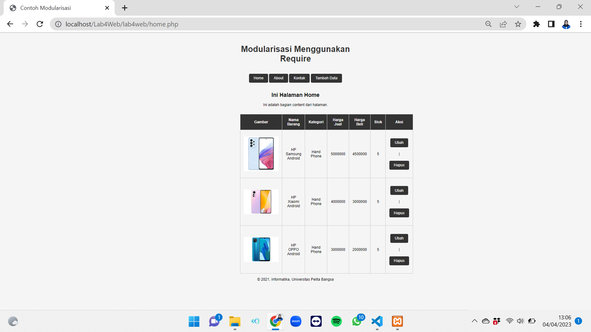
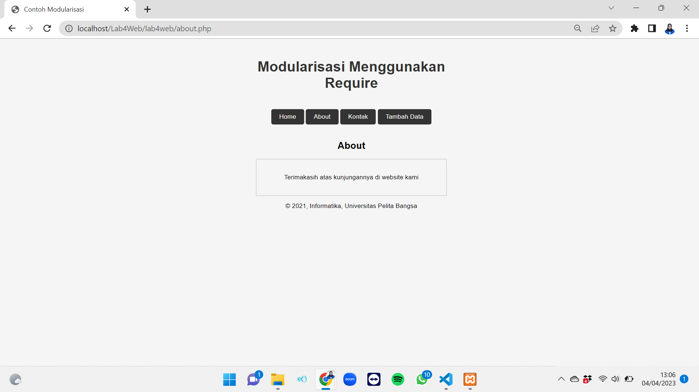
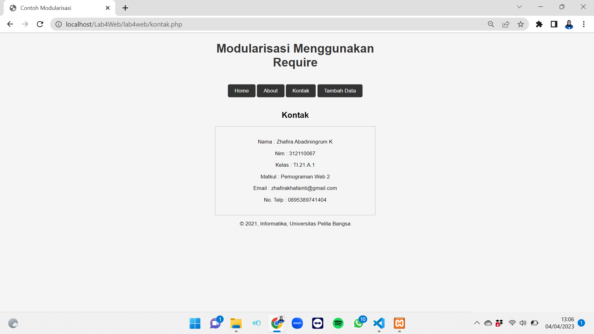

# lab4web


## Profil
| #               | Biodata           |
| --------------- | ----------------- |
| **Nama**        | Zhafira A. K      |
| **NIM**         | 312110067         |
| **Kelas**       | TI.21.A.1         |
| **Mata Kuliah** | Pemrograman Web 2 |

## Langkah-langkah Praktikum 4
Buat file baru dengan nama header.php<p>
```
<!DOCTYPE html>
<html lang="en">

<head>
    <meta charset="UTF-8">
    <title>Contoh Modularisasi</title>
    <link href="style.css" rel="stylesheet" type="text/stylesheet" media="screen" />
</head>

<body>
    <div class="container">
        <header>
            <h1>Modularisasi Menggunakan Require</h1>
        </header>
        <nav>
            <a href="home.php">Home</a>
            <a href="about.php">About</a>
            <a href="kontak.php">Kontak</a>
            <a href="tambah.php">Tambah Data</a>
        </nav>
```
Buat file baru dengan nama footer.php<p>
```
<head><link href="style.css" rel="stylesheet" type="text/css"></head>
<footer>
    <p>&copy; 2021, Informatika, Universitas Pelita Bangsa</p>
</footer>
</div>
</body>

</html>
```
Buat file baru dengan nama home.php<p>
```
<?php require('header.php'); ?>
<div class="content">
    <h2>Ini Halaman Home</h2>
    <p>Ini adalah bagian content dari halaman.</p>
</div>
<?php
include_once("koneksi.php");
// query untuk menampilkan data
$sql = 'SELECT * FROM data_barang';
$result = mysqli_query($conn, $sql);
?>
<!DOCTYPE html>
<html lang="en">
<head>
    <meta charset="UTF-8">
    <link href="style.css" rel="stylesheet" type="text/css" />
    <title>Data Barang</title>
</head>
<body>
    <div class="container">
        <div class="main">
            <table>
                <tr>
                    <th>Gambar</th>
                    <th>Nama Barang</th>
                    <th>Kategori</th>
                    <th>Harga Jual</th>
                    <th>Harga Beli</th>
                    <th>Stok</th>
                    <th>Aksi</th>
                </tr>
                <?php if ($result) : ?>
                    <?php while ($row = mysqli_fetch_array($result)) : ?>
                        <tr>
                            <td>" alt="<?= $row['nama']; ?>"></td>
                            <td><?= $row['nama']; ?></td>
                            <td><?= $row['kategori']; ?></td>
                            <td><?= $row['harga_jual']; ?></td>
                            <td><?= $row['harga_beli']; ?></td>
                            <td><?= $row['stok']; ?></td>
                            <td>
                                <a href="ubah.php?id=<?= $row['id_barang']; ?>">Ubah</a> |
                                <a href="hapus.php?id=<?= $row['id_barang']; ?>" onclick="return confirm('Anda yakin akan menghapus data ini?')">Hapus</a>
                            </td>
                        </tr>
                    <?php endwhile;
                else : ?>
                    <tr>
                        <td colspan="7">Belum ada data</td>
                    </tr>
                <?php endif; ?>
            </table>
        </div>
    </div>
</body>
</html>


<?php require('footer.php'); ?>
```
## Ini adalah tampilan home

Buat file baru dengan nama about.php<p>
```
?php require('header.php'); ?>
<div class="container">
    <h2>About</h2>
    <div class="box">
        <p> Terimakasih atas kunjungannya di website kami.</p>
    </div>
</div>
<?php require('footer.php'); ?>
```
## Ini adalah tampilan about


Buat file baru dengan nama kontak.php<p>
```
<?php require('header.php'); ?>
<div class="container">
    <h2>Kontak</h2>
    <div class="box">
        <p>Nama : Zhafira Abadiningrum K</p>
        <p>Nim : 312110067</p>
        <p>Kelas : TI.21.A.1</p>
        <p>Matkul : Pemograman Web 2</p>
        <p>Email : zhafirakhafianti@gmail.com</p>
        <p>No. Telp : 0895389741404</p>
    </div>
</div>
<?php require('footer.php'); ?>
```
## Ini adalah tampilan kontak

Buat file baru dengan nama index.php<p>
```
<!DOCTYPE html>
<html lang="en">

<head>
    <meta charset="UTF-8">
    <link href="style.css" rel="stylesheet" type="text/css" />
    <title>Data Barang</title>
</head>

<body>
    <div class="container">
        <div class="main">
            <table>

                <?php
                $mod = $_REQUEST['mod'];
                switch ($mod) {
                    case "home":
                        require("home.php");
                        break;
                    case "about":
                        require("about.php");
                        break;
                    case "tambah":
                        require("tambah.php");
                        break;
                    case "kontak":
                        require("kontak.php");
                        break;
                    default:
                        require("home.php");
                }
                ?>
            </table>
        </div>
    </div>
</body>

</html>
```
Langkah berikutnya adalah membuat file .htaccess<p>
```
<IfModule mod_rewrite.c>
 RewriteEngine On
 RewriteBase /lab4_php_modular/
 RewriteCond %{REQUEST_FILENAME} !-f
 RewriteCond %{REQUEST_FILENAME} !-d
 RewriteRule ^(.*)$ index.php?mod=$1 [L]
</IfModule>
```
## Terimakasih
